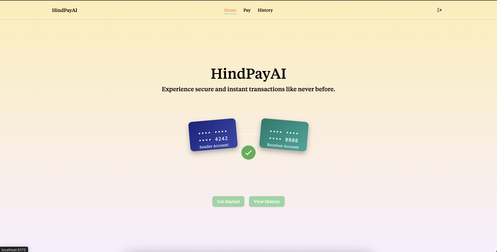
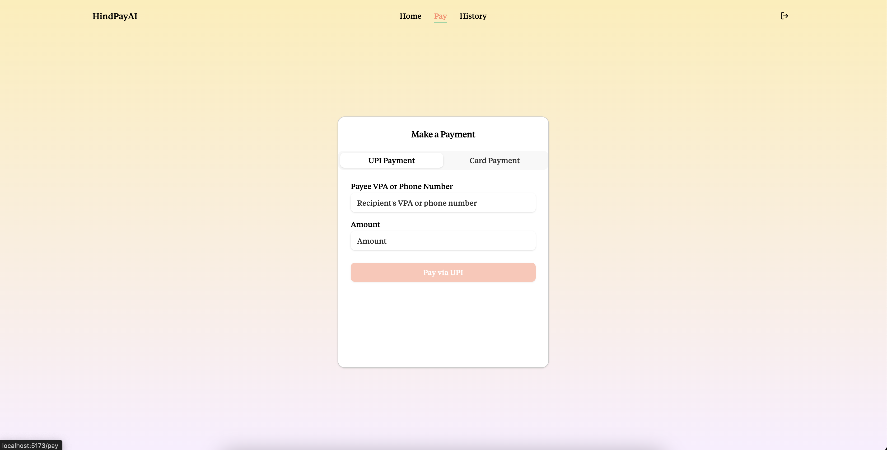
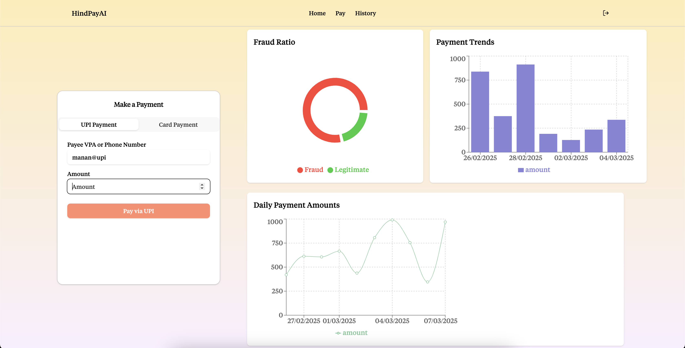

# HindPayAI

## Project Description

HindPayAI is an intelligent payment gateway solution that detects and prevents fraud in payer-to-merchant transactions. By leveraging Large Language Models (LLMs) and advanced anomaly detection, the system creates comprehensive profiles of both merchants and customers to identify suspicious activities before they result in financial loss.

## ScreenShots

## Problem Statement

Online payment fraud is growing at an alarming rate, resulting in billions of dollars in losses annually for businesses and consumers. Traditional fraud detection systems often:

-   React to fraud after it happens rather than preventing it
-   Rely on static rule-based approaches that fraudsters can learn to circumvent
-   Create friction in the customer experience with excessive security measures
-   Lack the ability to adapt to emerging fraud patterns and techniques

## Proposed Solution

HindPayAI implements a multi-layered approach to fraud detection and prevention:

1. **Merchant Risk Assessment:** Our LLM analyzes historical transaction patterns to identify and flag merchants with suspicious behavior. Users are warned before completing payments to high-risk merchants while still maintaining the freedom to proceed.

2. **Customer Behavioral Analysis:** The system builds individual customer profiles based on their transaction history. Any deviation from established patterns triggers anomaly detection algorithms to evaluate potential fraud risk in real-time.

3. **Contextual Transaction Monitoring:** Beyond individual transactions, HindPayAI monitors merchant activity holistically, flagging unusual patterns such as atypical transaction volumes, amounts, or timing that may indicate compromised accounts or fraud schemes.

4. **Intelligent Chargeback Management:**
    - Implements a dual verification system for chargeback requests
    - Identifies users with excessive chargeback history for additional verification
    - Warns users about merchants with high chargeback rates
    - Streamlines the chargeback process for legitimate claims against problematic merchants

## Business Value

HindPayAI delivers substantial business value across multiple dimensions:

### Financial Benefits

-   Reduces fraud losses by an estimated 60-80% through preventative measures
-   Decreases operational costs associated with manual fraud reviews
-   Minimizes chargebacks and associated fees
-   Lowers customer acquisition costs through improved trust and reputation

### Competitive Advantages

-   Offers a more secure payment experience than traditional gateways
-   Builds customer loyalty through demonstrated commitment to security
-   Creates a marketplace of trusted merchants
-   Enables data-driven insights for continuous improvement

### Operational Improvements

-   Reduces manual review workload for fraud teams
-   Accelerates legitimate transaction approvals
-   Provides actionable intelligence about fraud patterns
-   Supports compliance with evolving financial regulations

## Implementation Scale

HindPayAI is designed for scalable deployment across various business sizes and transaction volumes:

### Technical Architecture

-   Cloud-native microservices architecture enabling horizontal scaling
-   Real-time processing capabilities handling thousands of transactions per second
-   Secure API integrations with existing payment infrastructure
-   Machine learning pipeline for continuous model improvement

### Deployment Options

1. **Starter Tier:** For small businesses processing <10,000 monthly transactions
2. **Business Tier:** For medium enterprises handling up to 100,000 monthly transactions
3. **Enterprise Tier:** For large organizations with 100,000+ monthly transactions
4. **Custom Solutions:** Tailored implementations for unique business requirements

### Integration Capabilities

-   Seamless integration with major e-commerce platforms
-   SDK support for mobile and web applications
-   Webhook functionality for custom workflow automation
-   Comprehensive documentation and implementation support
